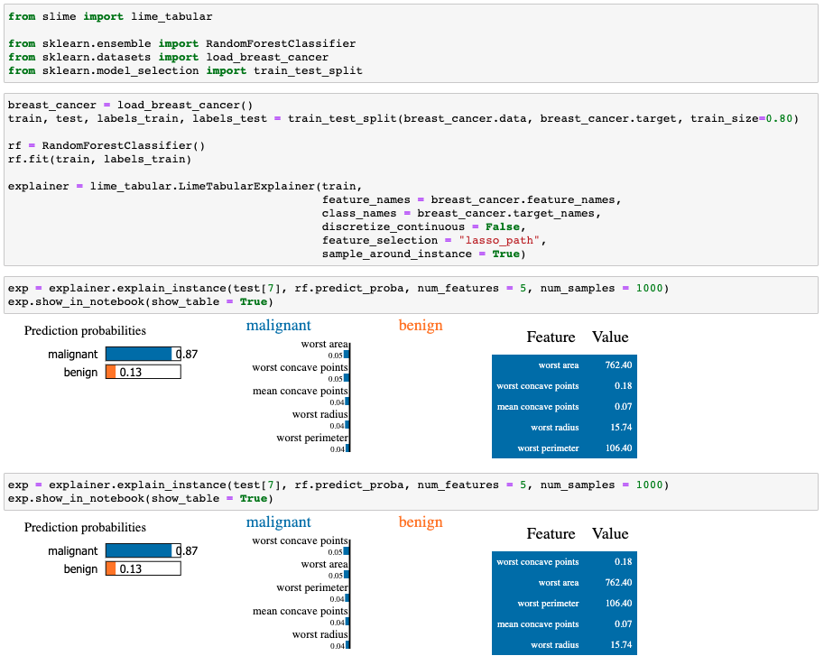
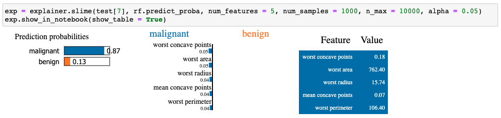

# slime

This repository holds code for replicating experiments in papar [S-LIME: Stabilized-LIME for Model Explanation]() to appear in [KDD2021](https://www.kdd.org/kdd2021/). 

It is built on the implementation of [LIME](https://github.com/marcotcr/lime) with added functionalities.

## Introduction

It has been shown that post hoc explanations based on perturbations (such as LIME) exhibit large instability, posing serious challenges to the effectiveness of the method itself and harming user trust. S-LIME stands for Stabilized-LIME, which utilizes a hypothesis testing framework based on central limit theorem for determining the number of perturbation points needed to guarantee stability of the resulting explanation. 

## Installation

clone the repository and install using pip:

```sh
git clone https://github.com/ZhengzeZhou/slime.git
cd slime
pip install .
```

## Usage

Currently, S-LIME only support tabular data and when feature selection method is set to "lasso_path". We are woring on extending the use cases to other data types and feature selection methods. 

The following screenshot shows a typical usage of LIME on breasd cancer data. We can easily observe that two runs of the explanation algorithms result in different features being selected.



S-LIME is invoked by calling **explainer.slime** instead of **explainer.explain_instance**. *n_max* indicates the maximum number of sythetic samples to generate and *alpha* denotes the significance level of hypothesis testing. S-LIME explanations are guranteed to be stable under high probability. 



## Notebooks

- [Breast Cancer Data](https://github.com/ZhengzeZhou/slime/blob/main/doc/notebooks/Breast%20Cancer%20Data.ipynb)
- [MARS](https://github.com/ZhengzeZhou/slime/blob/main/doc/notebooks/MARS.ipynb)
- [Dog Images](https://github.com/joangog/slime/blob/main/doc/notebooks/Dogs.ipynb)


